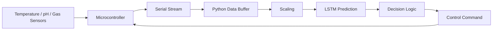

# LSTM-Based Biogas Monitoring & Feeding Control

<p align="center">
  <strong>Time-series AI for sensor-based biogas monitoring and control decisions</strong>
</p>

<p align="center">
  
  
  
  <a href="https://github.com/shaiksadik1725-droid/bio-gas/actions/workflows/python-syntax.yml"></a>
</p>

## Project at a Glance

| Item | Details |
|---|---|
| Domain | Biogas process monitoring |
| Inputs | Temperature, pH, gas reading |
| AI approach | LSTM time-series prediction |
| Interface | Serial communication with embedded hardware |
| Output | Predicted gas behavior + control decision |
| Status | Academic AI/embedded prototype |

## Overview

The project reads live sensor data from a microcontroller, builds a recent time-series window, trains an LSTM model, predicts future gas behavior, and combines that prediction with threshold logic to generate embedded control commands.

## Data & Decision Pipeline



## Technology Stack

- Python
- TensorFlow / Keras
- Pandas
- NumPy
- scikit-learn
- Joblib
- PySerial
- Embedded firmware

## Repository Structure

```text
bio-gas/
├── ESP32/
├── LSTM_AI.py
├── predict.py
├── biogas_lstm_model.h5
├── biogas_scaler.pkl
├── requirements.txt
└── .gitignore
```

## Setup

```bash
git clone https://github.com/shaiksadik1725-droid/bio-gas.git
cd bio-gas
pip install -r requirements.txt
```

Configure the correct serial port before running the training or prediction scripts.

## Engineering Notes

The AI prediction is combined with deterministic threshold logic rather than being used as the only safety mechanism. This separation is important for physical control systems.

## Future Work

- Move COM-port settings into configuration
- Save versioned training datasets
- Add train/validation/test evaluation
- Add a monitoring dashboard
- Add actuator acknowledgement
- Add fail-safe state handling
- Add reproducible experiments

## Author

**Sadik Shaik**

Computer Engineering · Artificial Intelligence · Embedded Systems
